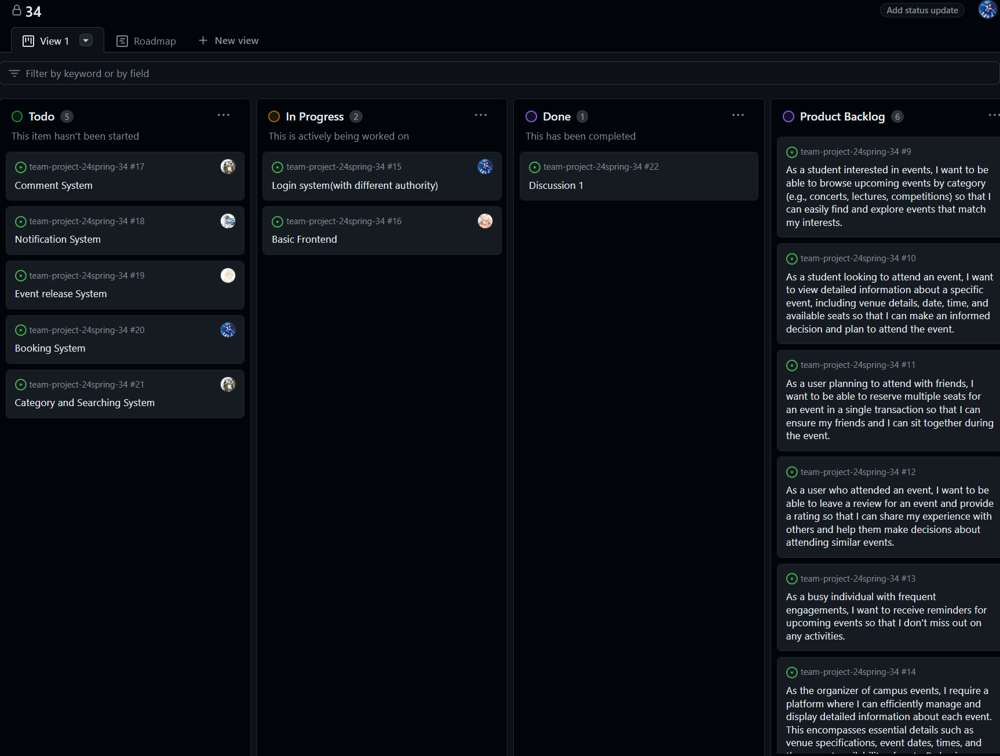
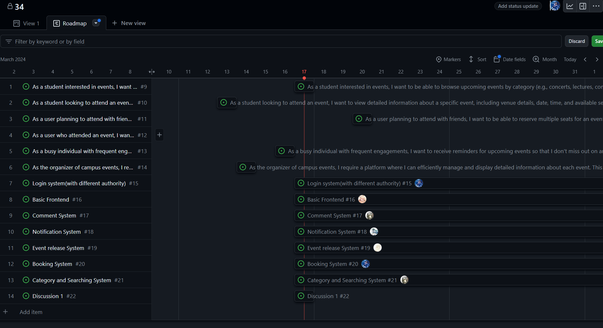

# Project Report 1

## Part I. Project Proposal

### Project Overview

#### Who are the target users or clients of the proposed system?

* **Casual Attendees:**
 Students who want to explore and attend various events happening on campus for leisure and entertainment. They are passionate about specific event categories, such as music, lectures, or sports, seeking a tailored experience.

* **Faculty and Staff:**
 Some faculty members are interested in academic lectures, seminars, and conferences for professional development. Some of the staff members are responsible for planning or coordinating events on campus.

* **Visitors and Guests:**
 Former students may be interested in staying connected and attending events, possibly for networking or reliving campus experiences. Also, Individuals visiting students, can seek information on campus events during their stay.

* **Student Organizations:**
  Groups planning and organizing events, utilizing the system for promotion, ticketing, and audience engagement.

* **University Departments:**
  Academic departments organizing lectures, workshops, and seminars, leveraging the system for efficient management.

#### What are the functionalities of the proposed system?

* **Event Information:**
  Users can explore detailed information about various events, including categories (music, lectures, sports, etc.), schedules, venues, and maps. Rich media content such as images, videos, and event descriptions enhance the user's understanding of each event.
  
* **Reservation and Booking:**
  Users can make reservations for events, book seats for performances, and purchase tickets through an integrated booking system. The system provides real-time updates on seat availability and allows users to choose preferred seats.

* **User Reviews and Ratings:**
  Users can write reviews and provide ratings for events they have attended, fostering a community-driven feedback system. Reviews can include text, ratings, and multimedia content to share personal experiences. The system facilitates communication between users, allowing them to discuss events, share opinions, and ask questions.Assistance features, such as a chat support system, help users with queries related to events, bookings, and other system functionalities. Users can share real-time information related to events, including live video clips, pictures, and updates. Social media integration enables users to share their experiences on external platforms.

* **Event Recommendations:**
  The system employs algorithms to provide personalized event recommendations based on user preferences, attendance history, and ratings.Recommendations enhance user engagement and help users discover new events aligned with their interests.

* **User Profiles:**
  Users can create and manage profiles, where they can track their event attendance history, manage reservations, and customize their preferences. User profiles contribute to a personalized experience and help the system tailor recommendations.

* **Event Organizer Tools:**
  Event organizers have access to tools for event management, including creating event listings, managing ticket sales, and analyzing attendee feedback.

* **Notification System:**
  The system sends notifications to users about upcoming events, reservation confirmations, and personalized recommendations. Users can customize their notification preferences to stay informed without being overwhelmed.

* **Search and Filtering:**
  Users can easily search for specific events or filter events based on categories, dates, venues, and other criteria. Advanced search functionalities enhance the user's ability to find events tailored to their preferences.

#### What is the expected outcome or overall goal of the proposed system?

* **Enhanced User Experience:**
  Users, including students, faculty, staff, and visitors, should have a seamless and enjoyable experience when exploring, booking, and attending campus events.

* **Efficient Event Management:**
  Event organizers benefit from efficient tools for managing events, ticket sales, and attendee engagement. The system provides organizers with valuable data to optimize future events.

* **Increased Event Attendance:**
  The system aims to increase participation in campus events by providing easy access to comprehensive event information, personalized recommendations, and streamlined booking processes.

* **Community Building:**
  The platform fosters a sense of community by facilitating communication, interaction, and information sharing among users attending similar events. This contributes to a more connected campus environment.

### Preliminary Requirement Analysis

#### Functional Requirements

* **Promotion and Visibility:**
  Artists, performers, speakers, and event organizers gain increased visibility and promotion through the platform. This can attract a larger audience and contribute to the success of events.

* **Timely Information:**
  The system ensures that users receive timely information about upcoming events, changes in schedules, and other relevant updates, minimizing the likelihood of missed opportunities.

* **Feedback and Improvement:**
  The system encourages user feedback through reviews and ratings, allowing event organizers to gather insights for continuous improvement. This creates a feedback loop that benefits both organizers and attendees.

* **Convenient Booking and Reservation:**
  Users can easily book tickets, reserve seats, and make reservations for events, enhancing the convenience and accessibility of attending campus activities.

* **User Engagement:**
  The system provides features to engage users, such as social media integration, live updates, and real-time communication. This encourages active participation and interaction among users.

#### Non-functional requirements

* **Performance:**
  The system should maintain an average response time of less than 500 milliseconds for all user interactions

* **Usability:**
  The system interface shall be intuitive and easy to navigate by providing a user-friendly interface, reducing the learning curve and minimizing errors during system interaction.

* **Security:**
  * Authentication: Users should log in with correct password.
  * Authorization: Participants and organizers should have different permissions of the system.
  * Data encryption: Use encryption algorithms and key management practices to protect sensitive data at rest and in transit.

* **Maintainability:**
The system can be easy to modify or extend. Have a coding standard and develop documentation.

* **Safety:**
The system shall prioritize user safety by implementing measures to prevent accidents, mitigate risks, and ensure the safe operation of the system.

### Data requirements

* **User Data:**
  The system should store user profiles, preferences, attendance history, and other relevant information to personalize the user experience and provide tailored recommendations.

* **Event Data:**
  The system should maintain comprehensive event listings, including categories, schedules, venues, descriptions, and multimedia content. This data is essential for users to explore and book events.

### Technical requirements

* **Frontend:**
  React.js, a popular JavaScript library for building user interfaces, will be used for the frontend development. React.js provides a component-based architecture, enabling the creation of reusable UI components and a responsive user interface.

* **Backend:**
  Node.js, a server-side JavaScript runtime, will be used for the backend development. Node.js provides a non-blocking I/O model, enabling efficient handling of concurrent requests and real-time interactions.
  MySQL, a popular open-source relational database, will be used for storing user data, event data, and other relevant information. MySQL provides robust data management capabilities and supports complex queries, making it suitable for the system's data storage requirements.

## Part II. Task Decomposition & Planning

## Part III. AI Usage

### Have you used AI to propose features for the project?

Yes. By leveraging various AI techniques such as ChatGPT, we can generate insightful recommendations for feature enhancements or new feature ideas. These AI-driven proposals can provide valuable insights to optimize project development and meet user needs effectively.

### Have you used AI to conduct the preliminary requirement analysis?

Yes. The functional requirements refer to the features. For nonfunctional requirements, we first ask ChatGPT “please write Non-functional requirements”, then it responses how to write nonfunctional requirements in several aspects. Then we ask, “how to write X”. (X for a specific aspect) Then it answers some description and methods. We use the answers with some correction.

### Have you used AI to generate user stories?

One example is utilizing ChatGPT to generate responses for user stories. We provided the prompts with specific issues and requirements, and ChatGPT generated appropriate responses based on its training data. However, we always review and refine the responses to ensure accuracy, clarity, and alignment with our brand voice. While we directly use AI-generated responses for efficiency, we also draw inspiration from AI-generated insights and suggestions to inform decision-making and brainstorming processes.

### Have you used AI to generate issues or tasks?

No. We used AIs but the responses are too broad, so we manually generate the issues and tasks ourselves.
