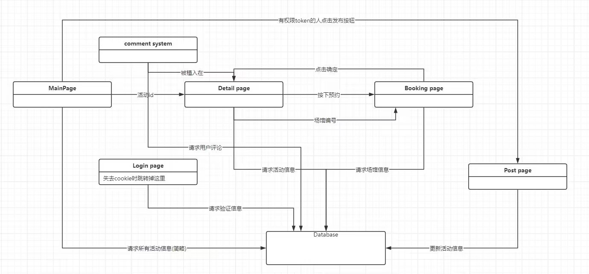
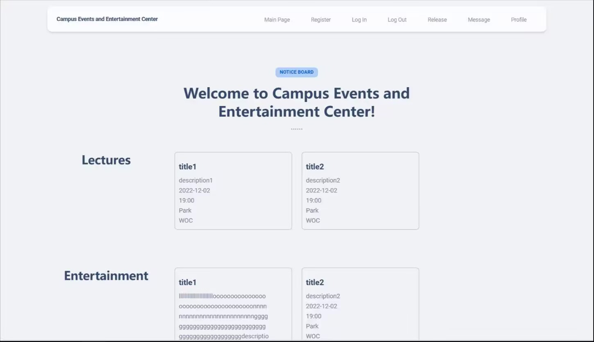
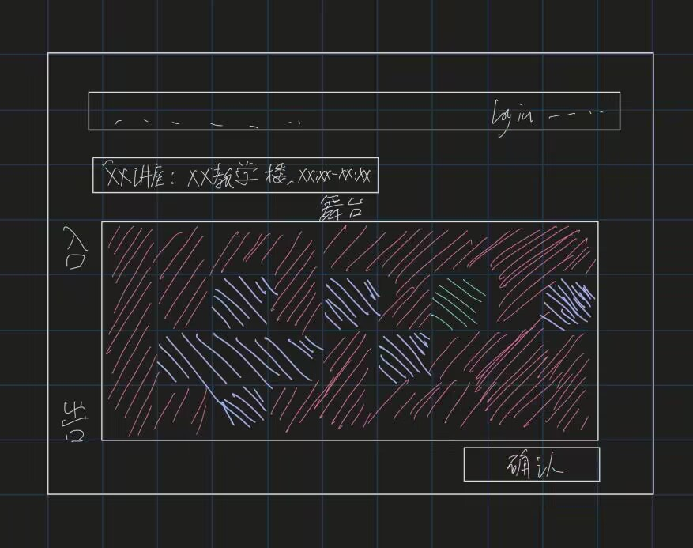
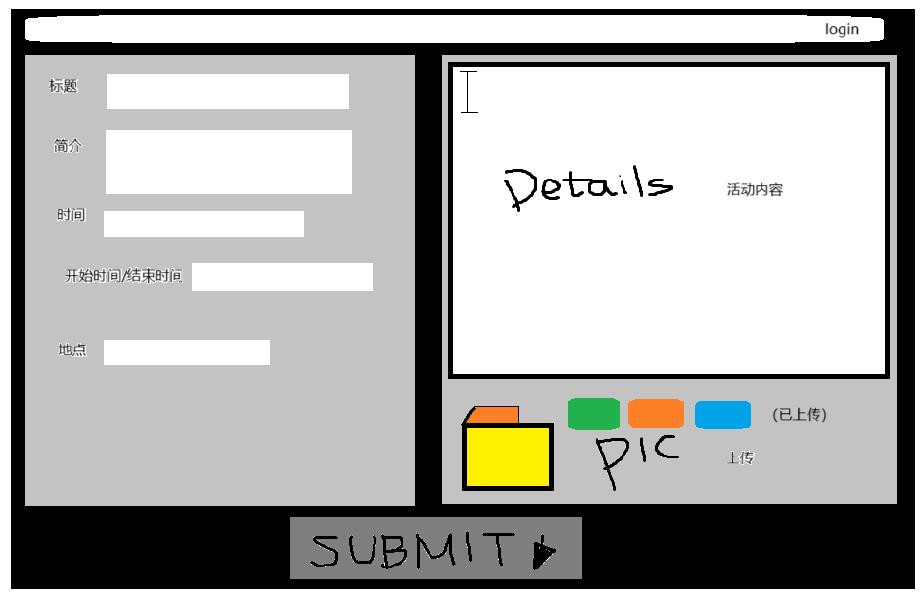

# Team34 Sprint1 Report

12112205 黄宁远 12112822 孔繁初 12112421 王德涵 12111719 廖辰益 12012937 周轶凡

## Part I. Architecture & UI Design

Our design is for an entertainment system website for a university. The webpage is divided into frontend and backend components. The frontend handles user interaction, comprising login, main, user booking, event organizer event submission, and event detail pages.

Our frontend is developed using the React framework.

The login page appears initially, requiring users to log in before accessing the entire system. The frontend retains user cookies, redirecting to the login page whenever cookies are lost.

Once inside the system, all pages feature a menu bar providing navigation options. The main page displays activity thumbnails and essential information, serving as the primary interface for users. Clicking on an activity takes users to its detailed page, revealing details such as time, location, and content. Users can make reservations for the activity on this page, leading them to the booking interface. Here, users select desired sessions and seats before confirming.

Event organizers can apply for event organizer tokens from the system, granting them permission. Users with this privilege can navigate to the event application page via the menu bar. This page allows organizers to input detailed information about the event, including time, location, content, and desired attendance. Upon completion, organizers can submit the form to publish the event.

Our backend is structured with a MySQL database, facilitating frequent interaction between frontend and backend. The backend stores all user information, event details, and venue information. User registration involves adding user information to the database, while publishers can add new event information by publishing new activities.

On the main page, the backend continuously updates activity information in real-time for users to access.

## Part II. UI Design

