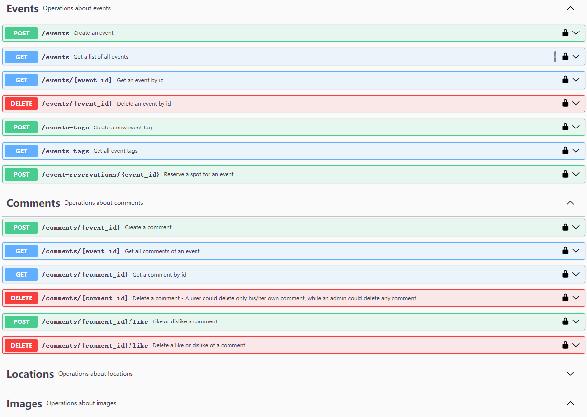

## Campus Events and Entertainment Center Final Report

### 1. Metrics
We utilized **plato**, a JavaScript source code complexity analysis tool, to analyze the complexity of our codebase. The lines of code, maintainability score, estimated errors in implementation and lint errors are calculated.

For the client, the total/average lines of code is 15226/94, and the average maintainability score is 64.58.

For the server, the total/average lines of code is 3229/161, and the average maintainability score is 60.87.

To regenerate the complete plato report for client and server, run the following commands:
```bash
cd client
plato -r -d plato-report src
```
```bash
cd server
plato -r -d plato-report src
```

Then the complete plato report can be found in `client/plato-report` and `server/plato-report`.

We also utilized **madge**, a tool to generate a json file representing the module dependencies in our codebase. The json file can be found in `client/dependency_tree.json` and `server/dependency_tree.json`. There are 410 dependency relationships in client and 437 dependency relationships in server.

To regenerate the json files that represents the module dependencies, run `madge --json src > dependency_tree.json` in the `client` and `server` directories.

Besides the above metrics, we also calculated the following metrics:

| Metric                                         | Client | Server |
|------------------------------------------------|:------:|:------:|
| **Number of packages/modules (directly used)** |   32   |   19   |
| **Number of source files**                     |  224   |   21   |

### 2. Documentation

#### 2.1 Documentation for End Users

##### 2.1.1 Register, Log In and Log Out

##### 2.1.2 Main Page

The navigation bar at the top includes, from left to right, "Search," "Home," "Event Release," "Messages," "Profile," "Login," and "Logout." Other pages also have similar navigation bars in similar positions. Below the notification board, various events are displayed, showing each event's title, start and end times, location, uploader, and other information. Clicking anywhere within the box will take you to the event's detail page.


##### 2.1.3 Profile Page

The personal page of different user groups will have differences. In the top left corner, there will be the user's avatar, nickname, user group,. Clicking on the avatar allows the user to upload a picture to change their avatar from the local device. In the bottom left, there are several sidebars. The first column is a universal personal profile. It displays some user information, and users can click on icons next to the text to make modifications. After modification, users can choose to save or cancel the changes. The subsequent sidebars vary depending on the user group:

- **Audience** : There is a history of events they've participated in.

- **Organizers** : In addition to the history of events, there are also currently valid events they have published. Organizers can delete events.

- **Administrators** : They have the ability to manage all events and users. They can delete all events, as well as remove or change the user group of non-administrator users

  

##### 2.1.4 Event Reservation

In the event details page, there are additional details about the event such as time, location, rating, number of ratings, classifications, etc. At the bottom, there is a reserve button. If there is remaining capacity, users can reserve a spot for this event.


##### 2.1.5 Event Release

On the event publishing page, you can add tags to the event, set its start and end date/time, event title, description, location, organizer, maximum capacity, and additional details. Additionally, you can also upload files and images from your local device.


##### 2.1.6 Notification

When a new event is uploaded, users will receive corresponding notifications.


##### 2.1.7 Search

The search page allows users to search for users and events, with options to filter and categorize the search results based on various criteria.


- ######  Search Bar

The search bar is located at the top of the page, where users can enter keywords to perform a search.


- ######  Filters


The filter section is located below the search bar and offers multiple filtering options:

- **All**: Selecting this option will simultaneously select or deselect the "User" and "Event" filters.
- **User**: Selecting this option will search for users.
- **Event**: Selecting this option will search for events.

If the "Event" filter is selected, the following search criteria can also be selected:

- **All**: Selecting this option will simultaneously select or deselect the "Title," "Tag," "Description," and "Organizer" search criteria.

- **Title**: Search by event title.

- **Tag**: Search by event tag.

- **Description**: Search by event description.

- **Organizer**: Search by event organizer.

  

- ######  Search Results


Search results are displayed in a card format, including user and event information. Each user card contains the user's nickname and ID, with a link to view detailed information. Each event card contains the event's title, ID, tag, description, and organizer, with a link to view detailed information.


#### 2.2 Documentation for Developers




### 3. Tests

We have unit tests for the backend. We used `jest` and `supertest` to implement these tests. To run the tests, you can use the following command:

```bash
cd server
npm test
```

Note that since the unit tests involve login, directly running `npm test` may result in test failures since the port is occupied. To avoid such issues, you may use the following command instead:

```bash
cd server
npm test src/test/user.test.js
npm test src/test/event.test.js
npm test src/test/comments.test.js
```

The cover rate of `user.test.js` is 38%, `event.test.js` is 42%, and `comments.test.js` is 41%.

The unit tests only check the basic functionality of the backend, and most of the tested functions are `GET` or `DELETE`. To fully ensure the correctness of the backend, we also conducted manual tests.

Our manual tests used the api-doc that were automatically generated by `swagger`. We firstly login as admin or an ordinary user, then we manually fill in the parameters and click the `Try it out` button to test the correctness of the backend. We tested all the APIs in the api-doc, including `GET`, `POST`, `PUT`, and `DELETE`. We also tested the APIs with invalid parameters to check the error handling of the backend.

### 4. Build

### 5. Deployment

We used GitHub Actions to deploy our project. We have three workflows: `CI/CD Pipeline`, `Lint` and `Publish Docker Image`.

- `CI/CD Pipeline` is triggered when pushing to the `main` branch. It will run the unit tests and compile the code.
- `Lint` is triggered when pushing to the `main` branch. It will check the code style.
- `Publish Docker Image` is triggered when pushing to the `main` branch. It will build the docker image and push it to the docker hub.


### 6. AI Usage

The primary AI tool used is ChatGPT-3.5. After setting up the rough frontend framework, if there's dissatisfaction with the current structure or a desire to enhance a particular component or adjust the layout, the AI tool is used to assist in achieving these goals. When encountering unknown errors during program execution, AI is also employed to help identify the errors. Finally, AI is utilized to aid in writing documentation, primarily responsible for translating Chinese into English.
